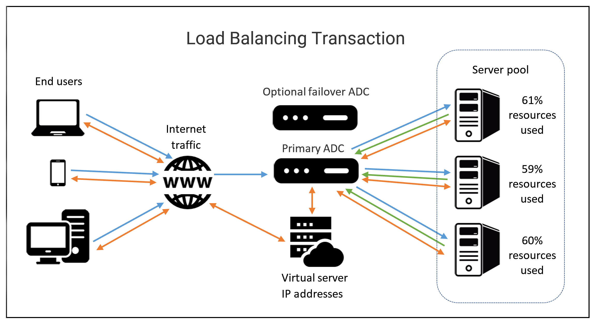

- [System Administration and IT Infrastructure Services](#system-administration-and-it-infrastructure-services)
  - [Modul 1: Introduction to Systems Administration and IT Infrastructure Services](#modul-1-introduction-to-systems-administration-and-it-infrastructure-services)
    - [What is Systems Administration](#what-is-systems-administration)
      - [What is Systems Administration?](#what-is-systems-administration-1)
      - [Servers Revisited](#servers-revisited)
      - [The Cloud](#the-cloud)
    - [System Administration Tasks](#system-administration-tasks)
      - [User and Hardware Provisioning](#user-and-hardware-provisioning)
      - [Routine Maintenance](#routine-maintenance)
      - [Vendors](#vendors)
      - [Vendor Life-Cycle for Custom Services and Products](#vendor-life-cycle-for-custom-services-and-products)
      - [Vendor Life-Cycle for Support of Commercial Products](#vendor-life-cycle-for-support-of-commercial-products)
      - [Troubleshooting and Managing Issues](#troubleshooting-and-managing-issues)
      - [In Case of Fire, Break Glass](#in-case-of-fire-break-glass)
    - [Network Services](#network-services)
      - [FTP, SFTP, and TFTP](#ftp-sftp-and-tftp)
      - [NTP (Network Time Protocol)](#ntp-network-time-protocol)
      - [Network Support Services Revisited](#network-support-services-revisited)
      - [DNS](#dns)
      - [DNS for Web Servers](#dns-for-web-servers)
      - [DNS for Internal Networks](#dns-for-internal-networks)
      - [DHCP](#dhcp)
      - [Quiz Network Services](#quiz-network-services)
    - [GA Network Services](#ga-network-services)
    - [Managing System Services](#managing-system-services)
      - [What do Services Look Like in Action](#what-do-services-look-like-in-action)
      - [Managing Services in Linux](#managing-services-in-linux)
      - [Managing Services in Windows](#managing-services-in-windows)
      - [Configuring Services in Linux](#configuring-services-in-linux)
      - [Configuring Services in Windows](#configuring-services-in-windows)
      - [Qwiklabs guidelines and troubleshooting steps](#qwiklabs-guidelines-and-troubleshooting-steps)
  - [Modul 2: Network Infrastructure Services](#modul-2-network-infrastructure-services)
    - [Configuring Network Services](#configuring-network-services)
      - [Configuring DNS with Dnsmasq](#configuring-dns-with-dnsmasq)
      - [Configuring DHCP with Dnsmasq](#configuring-dhcp-with-dnsmasq)
      - [Practice Quiz: Configuring Network Services](#practice-quiz-configuring-network-services)
        - [Network setup](#network-setup)
        - [Current configuration setup](#current-configuration-setup)
        - [Enabling debug logging](#enabling-debug-logging)
  - [Modul 3: Software Services](#modul-3-software-services)
    - [Software Services](#software-services)
      - [Communication Services](#communication-services)
      - [Email Services](#email-services)
      - [Spam Management/Mitigation](#spam-managementmitigation)
      - [User Productivity Services: Agreements and Licenses](#user-productivity-services-agreements-and-licenses)
      - [Web Server Security Protocols](#web-server-security-protocols)
      - [QUIZ: Software Services](#quiz-software-services)
    - [File Services](#file-services)
      - [What are File Services?](#what-are-file-services)
      - [Network File Storage](#network-file-storage)
      - [Mobile Synchronization](#mobile-synchronization)
    - [Platform Services](#platform-services)
      - [Web Servers Revisited](#web-servers-revisited)
      - [Load Balancers](#load-balancers)
      - [What is a database server?](#what-is-a-database-server)
      - [Quiz File, Print, and Platform Services](#quiz-file-print-and-platform-services)
    - [Troubleshooting Platform Services](#troubleshooting-platform-services)
      - [Is the website down?](#is-the-website-down)
      - [Quiz Troubleshooting Platform Services](#quiz-troubleshooting-platform-services)
    - [Menaging Cloud Resources](#menaging-cloud-resources)
      - [Cloud Concepts](#cloud-concepts)
      - [Typical Cloud Infrastructure Setups](#typical-cloud-infrastructure-setups)
      - [Common Cloud Models](#common-cloud-models)
      - [When and How to Choose Cloud](#when-and-how-to-choose-cloud)
      - [Quiz: Managing Cloud Resources](#quiz-managing-cloud-resources)
  - [Modul 4: Directory Services](#modul-4-directory-services)
    - [Directory Services](#directory-services)
      - [What is a Directory Service?](#what-is-a-directory-service)
      - [Implementing Directory Services](#implementing-directory-services)
      - [Quiz Introduction to Directory Services](#quiz-introduction-to-directory-services)
    - [Centralized Management](#centralized-management)
      - [What is centralized management?](#what-is-centralized-management)
    - [LDPA](#ldpa)
      - [What is LDAP?](#what-is-ldap)
      - [What is LDAP Authentication?](#what-is-ldap-authentication)
      - [Quiz Centralized Management and LDAP](#quiz-centralized-management-and-ldap)
    - [Active Directory](#active-directory)
      - [What is Active Directory?](#what-is-active-directory)
      - [Managing Active Directory](#managing-active-directory)
      - [User Accounts and Groups](#user-accounts-and-groups)
      - [Managing Active Directory User Passwords](#managing-active-directory-user-passwords)
      - [Joining an Active Directory Domain](#joining-an-active-directory-domain)
      - [Group Policy: Group Policy Object (GPO)](#group-policy-group-policy-object-gpo)
      - [Group Policy Creation and Editing](#group-policy-creation-and-editing)
      - [Group Policy Inheritance and Precedence](#group-policy-inheritance-and-precedence)
      - [Group Policy Troubleshooting](#group-policy-troubleshooting)
      - [Group Policy Troubleshooting: Common Issues](#group-policy-troubleshooting-common-issues)
      - [Group Policy Troubleshooting: Advanced Issues](#group-policy-troubleshooting-advanced-issues)
      - [Mobile Device Management (MDM)](#mobile-device-management-mdm)
      - [Quiz: Active Directory](#quiz-active-directory)
    - [OpenLDAP](#openldap)
      - [What is OpenLDAP?](#what-is-openldap)
      - [Managing OpenLDAP](#managing-openldap)
      - [Quiz Directory Services](#quiz-directory-services)
    - [Planing for Data Recovery](#planing-for-data-recovery)
      - [What is Data Recovery?](#what-is-data-recovery)
      - [Backing Up Your Data](#backing-up-your-data)
      - [Backup Solutions](#backup-solutions)
      - [Testing Backups](#testing-backups)
      - [Types of Backup](#types-of-backup)
      - [User Backups](#user-backups)
      - [Quiz Planning for Data Recovery](#quiz-planning-for-data-recovery)
    - [Disaster Recovery Planning](#disaster-recovery-planning)
      - [What's a Disaster Recovery Plan?](#whats-a-disaster-recovery-plan)
      - [Designing a Disaster Recovery Plan](#designing-a-disaster-recovery-plan)
      - [Quiz Disaster Recovery Plans](#quiz-disaster-recovery-plans)
    - [Post-Mortem](#post-mortem)
      - [What's a post-mortem?](#whats-a-post-mortem)
      - [Writing a Post-Mortem](#writing-a-post-mortem)
      - [Quiz Post-Mortem](#quiz-post-mortem)
    - [Quiz: Grade Assessment](#quiz-grade-assessment)
  - [Glosarium](#glosarium)

# System Administration and IT Infrastructure Services

## Modul 1: Introduction to Systems Administration and IT Infrastructure Services

### What is Systems Administration

#### What is Systems Administration?

- System administrators, or sysadmins, are responsible for managing an organization's IT infrastructure.
- The role of a sysadmin can vary depending on the size of the organization.
- The responsibilities of a sysadmin are closely related to the role of an IT support specialist who handles system administration.

#### Servers Revisited

- A sys admin is responsible for their company's IT services, such as email, file storage, and running a website.
- Clients request services from servers, and servers respond with these services.
- Servers can provide services to multiple clients at once, and clients can use multiple servers.
- Server hardware can come in different forms, such as **towers**, **rack servers**, and **blade servers**.
- In small IT organizations, a **KVM** switch can be used to control multiple servers using one keyboard, mouse, and monitor.

#### The Cloud

- **Datacenters** are facilities that store servers and are used by companies with large amounts of data.
- Cloud computing allows you to access data and use applications from anywhere with an internet connection.
- Using cloud services can be cost-effective in the short term, but costs can add up in the long term.
- **Dependency** on cloud platforms means that if there's an issue, someone else is responsible for fixing it.
- It's important to back up **critical** data both in the cloud and on **physical** storage to prevent data loss.

### System Administration Tasks

#### User and Hardware Provisioning

- System administrators have the responsibility of managing users and hardware in an IT infrastructure.
- They **create** new user accounts and provide access to company resources.
- They also **remove** users from the system when they leave the company.
- They standardize hardware provisioning and **settings** to **maintain** consistency.
- They consider the hardware lifecycle of a machine, including when it was **built**, **used**, and **maintained**.
- The hardware lifecycle consists of **procurement**, **deployment**, **maintenance**, and **retirement stages**.
- In a small organization, the hardware lifecycle may involve provisioning a computer for a new employee, imaging the computer, installing software, and eventually retiring or reallocating the machine.
- System administrators may need to **automate** the provisioning process in larger companies to save time.

#### Routine Maintenance

- Updates and maintenance to ensure they run the latest secure software.
- Batch updating is a common practice for effectively updating and managing hardware
- Batch updates are typically done for security updates and critical system updates, rather than every single software update.
- It's important to find time to take services offline, perform the update, and verify that the new update works with the service.
- Installing the latest security patches routinely is a good guideline to keep your system secure.

#### Vendors

- System administrators in small companies have to deal with various devices, **including computers, printers, phones, fax machines, and video/audio conferencing machines**.
- They may be responsible for setting **up phone lines, printers, and fax machine**s, as well as handling hardware procurement.
- Sys admins often work with vendors or other businesses to purchase hardware and establish relationships with them.
- They need to consider factors like **hardware compatibility, price, and formal approval** from their manager or leader before making any purchases.

#### Vendor Life-Cycle for Custom Services and Products

- The vendor life-cycle management process consists of three phases: **pre-contract, contract delivery, and post-contract**.
- Phase one - Pre-contract:
  - **Vendor identification and engagement**: Organizations identify potential vendors and collect information about their offerings.
  - **Vendor qualification and risk mitigation**: Shortlisted vendors undergo a qualification process to assess their suitability and mitigate risks.
  - **Vendor evaluation and selection**: The organization evaluates vendor information based on factors like history, ratings, expertise, cost, and responsiveness. A vendor is selected based on these evaluations.
  - **Vendor information management and onboarding**: The selected vendor goes through an onboarding process, where their information is recorded, and they receive necessary training and equipment.

- Phase two - Contract delivery:
  - **Performance management monitoring**: A project manager monitors the vendor's performance, ensuring they meet the contracted expectations.
  - **Risk management**: Potential risks, such as supply chain disruptions or product upgrade limitations, are monitored and managed.
  - **Vendor relationship management**: Organizations develop communication plans, maintain healthy partnerships, and ensure mutual benefits.

- Phase three - Post-contract:

  - **Vendor offboarding**: When the project ends, the organization analyzes the vendor's fulfillment of contractual obligations
  - **Warranties**: Detailed records of warranties provided by the vendor are kept, and stakeholders are informed about their inclusions and expiration dates.
  - **Post-contract support**: Records of any post-contract services, like technical support, are maintained.
  - **Post-contract** closing: The organization completes an offboarding checklist, which may include returning IT equipment and removing vendor identity profiles.

#### Vendor Life-Cycle for Support of Commercial Products

- The end of life (EOL) date is when the vendor plans to end all support for the product and it becomes a legacy product.

#### Troubleshooting and Managing Issues

- Two critical skills for system administrators are troubleshooting and customer service.
- System administrators may need to be available around the clock to address server or network issues.
- Ticketing or bug systems are commonly used to track troubleshooting work and prioritize issues.

#### In Case of Fire, Break Glass

- It is crucial to regularly back up your company's data and store it in a location separate from your main office.

### Network Services

#### FTP, SFTP, and TFTP

- **FTP** (File Transfer Protocol) is a legacy way to transfer files over the Internet. It is primarily used today to share web content.
- **SFTP** (Secure FTP) is a secure version of FTP that encrypts data during the transfer process.
- **TFTP** (Trivial FTP) is a simpler way to transfer files than FTP and does not require user authentication. It is often used to host installation files.
- **PXE (Pre Boot Execution)** or pixie boot allows booting into software available over the network, which is useful for network-based software installations.

#### NTP (Network Time Protocol)

- It is commonly used in airports to ensure that departure and arrival screens display accurate **times**.
- There are two ways to set up **NTP**: using a local NTP server or a public NTP server.
- With a **local** NTP server, you install NTP server software on a managed server and NTP clients on other machines, syncing their time to the server.
- **Public NTP servers**, managed by other organizations, can be used to synchronize time without running a dedicated NTP server.
- It's good practice to run your own **NTP server** and have it point to a public NTP server to avoid connecting all clients directly to a public server.

#### Network Support Services Revisited

- Two common internal network services are **Intranets** and **proxy servers**.
- **Proxy servers** act as intermediaries between a company's network and the Internet. They keep company network **traffic private** and can be used to monitor and regulate access to certain websites.

#### DNS

- DNS (Domain Name System) is a network service that maps human-readable domain names to IP addresses.
- It is important to set up and maintain DNS correctly in order for people to access websites by their names.
- DNS allows you to map IP addresses to easy-to-remember host names.

#### DNS for Web Servers

- To point your domain name to where your web content is located, you can use DNS settings provided by your domain **registrar** or set up an **authoritative** DNS server if you host your web content yourself.

#### DNS for Internal Networks

- One way to do this is by using a local host file, which contains static IP address to hostname mappings.
- In Linux, the host file is located at **/etc/hosts** and can be edited to map IP addresses to hostnames.
- DNS can also be integrated with a directory service, such as **Active Directory** or **LDAP**, to automatically populate machine to **IP** address mappings.

#### DHCP

- **DHCP** is a network service that makes managing IT infrastructure easier.
- It allows you to automatically assign IP addresses to computers on a network.
- DHCP leases out IP addresses from a DHCP server to client machines.
- To configure a DHCP server, you need to determine the IP range, DNS server locations, gateway, and subnet mask.
- Different DHCP server software may have different configuration settings.
- Windows Server versions come with the DHCP service built-in.
- DHCP and DNS can be integrated so that DNS updates its IP address mapping automatically when DHCP leases out new addresses.

#### Quiz Network Services

1. What is one benefit of using TFTP over SFTP? **Simpler transfer without authentication**
2. What service can you use to keep time synchronized across the machines on your fleet? **NTP**
3. What features does a proxy offer? Check all that apply.
   1. Network privacy
   2. Network traffic monitoring
   3. Internet traffic filtering
4. If you want to point a domain name to a web server or use hostnames within your company, what network protocol can you use? **DNS**
5. If you don't want to use static IP addresses, but want to dynamically assign IP addresses to computers instead, what network protocol can you use? **DHCP**

### GA Network Services

1. Which service gives access to pre-configured virtual machines that can be used like physical servers? **IaaS**
2. What type of cloud service allows app developers to build code, store information in a database and serve their applications from a single place? **PaaS (Platform as a Service)**
3. Which of the following is a benefit of virtualization compared to using dedicated hardware? **Maintenance**
4. Which of the following are typically included with server operating systems to help optimize server functionality? Select all that apply
   1. More RAM capacity
   2. Allow more network connections
   3. Added security
5. What is a type of tool a client could use to access a server and transfer files? **An FTP Client**
6. A sysadmin wants to use preboot execution over a network. Which type of server will the sysadmin likely use to administer operating system installation files? **A TFTP server**
7. PuTTY in Windows is similar to which Linux tool? **SSH**
8. Which of the following are reasons for using DNS? Select all that apply.
   1. It maps local addresses to simple names without editing hosts files.
   2. It maps names humans can understand to IP addresses.
9. What does DHCP do? **DHCP assigns IP addresses to computers on a network.**
10. A network technician sets up an internal DNS server for a local network. When the technician types in a URL, which is checked first? **The local host file**

### Managing System Services

#### What do Services Look Like in Action

- Services run as background processes or daemons, and each service has one or more configuration files that you will use as a system administrator to determine its behavior

#### Managing Services in Linux

- In Linux, services are managed using the **systemd** service manager.
- The **systemctl** command is used to manage services in **systemd**.
- The **systemctl** command can be used to start, stop, restart, and check the status of services.

#### Managing Services in Windows

- To check the status of a service, you can use the "**Get-Service**" command in PowerShell.
- Only **administrators** can start or stop a service, not regular users.
- To stop a service, you can use the **Stop-Service** command in an administrative PowerShell.
- To start a service, you can use the **Start-Service** command in PowerShell.
- The services management console provides a graphical interface to manage services.

#### Configuring Services in Linux

- On Linux, configuration files for installed services are located in the **/etc** directory and typically need to be edited with a text editor.
- The page provides an example of configuring an **FTP** server called **vsftpd**.
- To enable anonymous connections, the **configuration** file for the **FTP** server needs to be modified.
- After making changes to the **configuration** file, the service needs to be reloaded for the new configuration to take effect.
- **Reloading** the service allows ongoing connections to continue without interruption while new connections use the new configuration.

#### Configuring Services in Windows

- Internet Information Services (IIS) on a Windows machine to serve web pages.

#### Qwiklabs guidelines and troubleshooting steps

- Qwiklabs is an online lab tool used in this course for hands-on activities related to system administration and IT infrastructure services.

## Modul 2: Network Infrastructure Services

### Configuring Network Services

#### Configuring DNS with Dnsmasq

- dnsmasq, a program that provides DNS, DHCP, TFTP, and PXE services in a simple package.
- dnsmasq is a lightweight DNS forwarder and DHCP server that can be used to set up a local network.

#### Configuring DHCP with Dnsmasq

- The **DHCP** server configuration file (dhcp.config) contains options such as the interface to listen on, **domain name**, **default gateway**, **DNS servers**, **DHCP range**, and **lease time**.
- The **lease time** determines how long an IP address is reserved for a client.
- The **DHCP range** specifies the range of IP addresses that the **DHCP server** can assign to clients.
- To start the **DHCP server**, the command "sudo dnsmasq -d -q -c dhcp.config" is used.
- The **DHCP client** (e.g., sudo dhclient -i eth_cli -v) requests an IP address from the DHCP server.
- The **DHCP server** assigns an IP address to the client, and the client interface is configured with the assigned IP address.

#### Practice Quiz: Configuring Network Services

##### Network setup

- `ip address show eth_srv` - Show the IP address of the server.
- `ip address show eth_cli` - Show the IP address of the client.

##### Current configuration setup

`cat /etc/dnsmasq.d/mycompany.conf` - Show the current configuration of the DNS server.

##### Enabling debug logging

`sudo service dnsmasq status` - Check the status of the DNS server.
`sudo service dnsmasq stop` - Stop the DNS server.
`sudo nano /etc/dnsmasq.d/mycompany.conf` - Edit the configuration file.
`sudo dnsmasq --test -C /etc/dnsmasq.d/mycompany.conf` - Test the configuration file.

## Modul 3: Software Services

### Software Services

#### Communication Services

- Explore different methods of instant communication, including protocols like **IRC** and **XMPP**, as well as popular chat applications like **HipChat** and **Slack**

#### Email Services

- Email Vital: Crucial for enterprise communication.
- Domain Setup: Establish domain like example.com for company email.
- Setup Options: Own server with email software or cloud service like Google Suite.
- Server Challenges: Complex setup, spam protection, virus filtering.
- Email Protocols:
  - **POP3**: Downloads to local device, good for storage limits, privacy.
  - IMAP: Accessible on multiple devices, stores on server.
  - SMTP: Sending emails.
- Protocol Considerations: Storage, privacy, accessibility influence choice.
- Service Criticality: Essential for internal, external communication; choice between own server or cloud service crucial.

#### Spam Management/Mitigation

- Spam refers to unsolicited messages or calls sent to a large number of recipients.
- Phishing emails try to trick recipients into providing personal information or clicking on malicious links.
- Text spam is less elaborate than email spam and often contains a brief clickbait message followed by a link.
- Email spoofing involves emails that appear to be from reputable companies but are actually forged.
- Cloud platforms like Google Workspace offer spam mitigation and management solutions, such as **DKIM**, **SPF**, and **DMARC**.

#### User Productivity Services: Agreements and Licenses

- **Software licenses** have different terms and agreements, so it's important to review them before making a decision.
- **Cloud software** services may have additional features for businesses and enterprises, such as dedicated customer support.

#### Web Server Security Protocols

- Security protocols are put in place to keep data encrypted and ensure authentication.
- **HTTPS** (Hypertext Transfer Protocol Secure) is the secure version of HTTP.
- **HTTPS** uses two protocols: **TLS** (Transport Layer Security) and **SSL** (Secure Socket Layer).
- **TLS** is widely used to keep web browsing secure.
- **SSL** has been deprecated in favor of TLS due to its insecurity.
- To enable **TLS** on a server and use **HTTPS**, a digital certificate of trust is needed from a certificate authority.
- Certificates verify the trustworthiness of a website.

#### QUIZ: Software Services

1. What are some communication services you can utilize in your organization? Check all that apply.
   1. Email
   2. Chat applications
   3. Phones
2. What's the difference between POP3 and IMAP? Check all that apply.  
   1. POP3 can only download email to one local device.
   2. IMAP can download emails onto multiple devices.
3. True or false: Commercial-use and personal-use software licenses are essentially the same thing. **FALSE**
4. What are the differences between TLS and SSL? Check all that apply.  
   1. TLS is the successor to SSL.
   2. TLS is more secure than SSL.

### File Services

#### What are File Services?

- That allow organizations to share and manage files efficiently
- setting up a file storage server or using a cloud file storage provider.

#### Network File Storage

- The content discusses the **Network File System (NFS)** and how it allows files to be shared over a network.
- **NFS** is compatible with all major operating systems and can be set up easily using a Linux environment.
- To access an **NFS server**, you need to **mount** the file system on the client machine using the host name.
- **Samba** is similar to **NFS** and allows for centralized file sharing and management. It works better with Windows operating systems and includes additional services like printer services.
- **Network Attached Storage (NAS)** is another option for file storage. NAS devices are **optimized** for file storage and come with ample storage space.

#### Mobile Synchronization

- **Mobile devices risk data loss**: They contain valuable data but are prone to loss or theft.
- **Sync critical data**: Ensure important data is synchronized with another location for backup.
- **IT support ensures data recovery**: Identify critical data for organization and users, prioritize backup.
- **Automatic sync by apps**: Many apps sync data with the cloud for seamless access.

### Platform Services

#### Web Servers Revisited

- Platform services provide a platform for developers to build and deploy software applications without dealing with OS maintenance, server hardware, networking, or other services.
- A web server stores and serves content to clients through the Internet. It processes HTTP requests and sends out HTTP responses with the requested content.
- The Apache HTTP Server is a widely used HTTP server software that helps serve a large percentage of web pages on the Internet.
- Your computer has an IP address (127.0.0.1) or a hostname (localhost) associated with it, which you can use to access the web server content running on your machine.

#### Load Balancers

- Load balancing **terminology** includes concepts like clients, hosts/nodes, members, pools/clusters/farms, and application delivery controllers (ADCs).
- There are different types of load balancers, such as application load balancers, network load balancers, classic load balancers, and gateway load balancers.

#### What is a database server?

- When running a web service, you need a web server to serve web pages to clients.
- Information like customer data, news articles, videos, and large files are typically stored in a database.
- Databases allow us to **store**, **query**, **filter**, and manage large amounts of data.
- Common database systems like **MySQL** and **PostgresSQL** are widely used in web development and data analytics.

#### Quiz File, Print, and Platform Services

1. What is the name of a protocol that lets users share files over a network? **NFS**
2. Which two of these methods could you use to set up printing in an organization?
   1. Setting up a print server
   2. Using a Cloud service to set up printers
3. When you have a web server, what service is used to enable HTTP requests to be processed? **An HTTP server**
4. Fill in the blank: You can use a(n) ______________to store large amounts of customer data for a website. **database server**
5. What is software that can modify, steal or delete data, and is a threat to the practice of BYOD (Bring Your Own Device)? **Malware**

### Troubleshooting Platform Services

#### Is the website down?

- **HTTP** status codes are numbers that indicate errors or information messages when accessing a web resource
- **HTTP** status codes starting with 4xx indicate client-side issues,
- while codes starting with 5xx indicate server-side issues.

#### Quiz Troubleshooting Platform Services

1. HTTP status codes that begin with 4xx, like 404, indicate: **Client-side issues**
2. HTTP status codes that begin with 5xx, like 501, indicate: **Server-side errors**
3. What are tools that are built into browsers to help diagnose issues with the browsers? **Developer tools**
4. What do HTTP status codes beginning with 2xx indicate? **Successful request**
5. Which of these leads to a 404 error? **You type in the human readable name for a site that no longer exists.**

### Menaging Cloud Resources

#### Cloud Concepts

- The Cloud refers to services that are running somewhere else, either in a data center or on remote servers.
- Different types of machines are used for different services in the Cloud.
- **Software as a Service (SaaS)** means that the software is **pre-configured** and the user isn't **deeply involved** in the Cloud configuration.
- **Infrastructure as a Service (IaaS)** means that you're hosting your own services in the Cloud and need to decide how you want the infrastructure to look.
- When setting up **Cloud resources**, you need to consider regions, which are geographical locations containing data centers.
- **Public, private, and hybrid Clouds** are different deployment models for Cloud services.

#### Typical Cloud Infrastructure Setups

- In a typical setup for a web server running in the cloud, **multiple virtual machines** (VMs) serve the same website.
- A load balancer ensures that each VM receives a balanced number of queries.
- **Autoscaling** allows the service to increase or reduce capacity as needed, spinning up more VMs when there are a lot of queries and shutting down some when the demand is lower.
- **Local disks** on VMs are **ephemeral**, so if you need data persistence, you have to create separate storage resources and connect them to the VMs.

#### Common Cloud Models

- There are three primary cloud services: Software as a Service (SaaS), Platform as a Service (PaaS), and Infrastructure as a Service (IaaS).
- **SaaS** allows users to access software through an internet browser or application **without** downloading it to a specific device.
- **PaaS** offers computer hardware and software in the cloud for **developing** and **deploying** applications or cloud-based services.
- **IaaS** provides IT infrastructure over the internet, including virtual machines, containers, networks, and storage.
- Other cloud services include VPN as a Service (**VPNaaS**), Function as a Service (**FaaS**), Data as a Service (**DaaS**), and Blockchain as a Service (**BaaS**).
- There are four main types of cloud computing: **public clouds, private clouds, multiclouds, and hybrid clouds.**
- **Private clouds serve a single business** or **organization** and run behind an internal firewall.
- **Hybrid clouds blend public** and **private cloud services** and connect them with internal networks.

#### When and How to Choose Cloud

- Cloud infrastructure is a good choice when you don't want to make a large upfront investment and need temporary or variable infrastructure.
- It's also beneficial when your users are distributed globally and you need data centers in different locations.
- To choose a Cloud provider, compare their services and test them out with free trials.
- Stay updated on the latest changes in the field of Cloud services before making a decision.

#### Quiz: Managing Cloud Resources

1. Which of the following are popular paid-for options for setting up IM services for your organization? Select all that apply.

## Modul 4: Directory Services

### Directory Services

#### What is a Directory Service?

- A directory server is a lookup service that maps network resources to their network addresses.
- Directory services use a **hierarchical model** of objects and containers, similar to a file system, to organize data and make it searchable.
- The structure includes organizational units (OUs) that can contain objects or more OUs
- **A systems administrator is responsible** for setting up, configuring, and maintaining the directory server, including the OS and the directory service itself.

#### Implementing Directory Services

- Directory services became an open network standard for interoperability among different software vendors.
- **The X.500** directory standard was approved in 1988 and included protocols like **DAP, DSP, DISP, and DOP.**
- **LDAP** is a popular alternative to DAP for accessing the X.500 directory.
- There are various implementations of directory services, including **Microsoft's Active Directory (AD)** and open source implementations like **openLDAP**.

#### Quiz Introduction to Directory Services

1. What does a directory server provide? **A lookup service for an organization.**
2. What benefits does replication provide? Check all that apply.
   1. Redundancy
   2. Decreased latency
3. What is the most popular directory services protocol used today? **Lightweight Directory Access Protocol**
4. Active Directory is the LDAP implementation for ________________. **Microsoft**
5. The containers in a Directory Service are referred to as _____________. **organizational units (OUs)**

### Centralized Management

#### What is centralized management?

- The role of a systems administrator is to manage and administer systems in an organization.
- Centralized management is important for efficient administration.
- Directory services provide centralized **authentication**, **authorization**, and **accounting** (AAA) for computers and applications.
- **User groups** are used to organize user accounts and manage access to resources based on roles.
- **Role-based access control (RBAC)** allows for easier management of access rights.
- Configuration management can also be centralized to streamline processes.
- **Logon scripts** can be used as a simple tool for centralized configuration management.

### LDPA

#### What is LDAP?

- LDAP (Lightweight Directory Access Protocol) is an underlying protocol used in directory services.
- LDAP is used to access information in directory services over a network.
- Two popular directory services that use LDAP are **Active Directory** and **OpenLDAP**.
- LDAP supports various operations, **such as adding**, **deleting**, and **modifying** entries in the directory server database.
- An **LDAP entry is a collection** of information used to describe something.
- **LDAP entries** have a unique entry name (distinguished name), **attributes**, and **values associated** with them.
- Attributes in LDAP entries include **common name (CN)**, **organizational unit (OU)**, and **domain component (DC)**.

#### What is LDAP Authentication?

- **LDAP** allows for different authentication levels to restrict access to directories.
- There are three common authentication methods in LDAP: **anonymous**, **simple**, and **SASL** **(Simple Authentication and Security Layer)**.
- Anonymous binding allows anyone to potentially access the directory.
- **Simple authentication** requires a directory entry name and password, but it is not secure as it is sent in plain text.
- **SASL** authentication is a more secure method that can use security protocols like TLS and Kerberos.
- **Kerberos** is a network authentication protocol used to authenticate user identity and secure user credentials.

#### Quiz Centralized Management and LDAP

1. Which of these are examples of centralized management? Check all that apply.
   1. Role-based access control
   2. Centralized configuration management
2. Which of these are components of an LDAP entry? Check all that apply.
   1. Distinguished name
   2. Common Name
3. What's does the LDAP Bind operation do exactly? **It authenticates the client to the directory server.**
4. Which of the following are authentication types supported by the LDAP Bind operation? Check all that apply.
   1. Anonymous
   2. Simple
   3. SASL
5. Which of the following are services provided for the Directory Services?
   1. Authorization
   2. Centralized Authentication
   3. Accounting

### Active Directory

#### What is Active Directory?

- **Active Directory** is a directory service developed by Microsoft for Windows domain networks.
- AD works with the LDAP protocol and can inter-operate with Linux, OSX, and other non-Windows hosts

#### Managing Active Directory

- Managing Active Directory is a **complex task** for system administrators.
- The most important user groups in Active Directory are:
  - **Domain Admins**: They have full control over the domain and can make changes to all computers in the domain.
  - **Enterprise Admins**: They have permissions to make changes that affect multiple domains in a forest.
  - **Domain Users**: This group includes all user accounts in the domain.
  - **Domain Computers**: This group includes all computers joined to the domain, except domain controllers.
  - **Domain Controllers**: This group includes all domain controllers in the domain.
- Delegation can be used to grant specific administrative tasks to users without giving them broad access to make changes in Active Directory.

#### User Accounts and Groups

- There are two categories of groups in Active Directory: **security groups** and **distribution groups**.
- Security groups are used to grant or deny access to **IT resources**, while distribution groups are used for email communication.
- **Group scope** determines how group definitions are replicated across domains in a network.
- The three types of group scopes are **domain local, global, and universal**.
- Domain local groups are used to **assign permissions** to resources within a domain.
- **Global groups** are used to group accounts into roles, such as researchers or salespeople.
- **Universal groups** are used to group global roles in a forest and are **replicated** to all domains in the forest.

#### Managing Active Directory User Passwords

- Central authentication simplifies password management.
- **Active Directory (AD)** stores a one-way cryptographic hash of passwords, not the actual passwords.
- Knowing another person's password is generally **discouraged** for security reasons.
- Auditing becomes difficult if multiple people can authenticate with the same username and password.
- As an IT support specialist, you may be **authorized** to reset passwords for users who forget them.
- Password resets should only be done when authorized and following organizational policies and procedures.
- Resetting a password can result in loss of access to encrypted files if the user has used the NTFS **Encrypting File System (EFS)** feature.

#### Joining an Active Directory Domain

- **Windows workgroup computers** are not centrally administered, so joining them to the domain allows for central administration and authentication in the network.
- To join a computer to the domain, you need to go to "**Computer**" and then "**System propertie**s" and click on "**Change settings**." Select the "**Domain**" option and enter the domain name. The computer will reach out on the network to find a domain controller and ask for a username and password to authorize the join.

#### Group Policy: Group Policy Object (GPO)

- **Group Policy Objects (GPOs)** are sets of policies and preferences that can be applied to objects in the directory.

#### Group Policy Creation and Editing

- The **Group Policy Management Console (GPMC)** is an important tool for creating and viewing Group Policy Objects (GPOs).
- Group Policy Objects can only be **linked** to domain sites and Organizational Units (OUs), not to the default containers for user and computer objects.
- GPOs are divided into two sections: **computer configuration and user configuration**, each with policies and preferences.
- Advanced Group Policy Management (AGPM) is an add-on tool that provides additional revision control abilities for GPOs.

#### Group Policy Inheritance and Precedence

- **GPOs** are applied based on the containers that contain the computer and user account, with the least specific or largest container applied first and the most specific or smallest container applied last.
- If there are multiple GPOs linked to the same container, the link order determines the precedence of the policies.
- The last GPO to modify a specific setting wins.
- The **Group Policy Management Console (GPMC)** can be used to view the precedence rules in action and generate a resultant set of policy (RSOP) report to see which policies are applied to a specific computer or user.

#### Group Policy Troubleshooting

- Common reasons for login failures, such as mistyped passwords, locked accounts, system settings changes, or software bugs.
- The importance of starting with simple solutions, such as checking network connectivity, before diving into Active Directory-specific troubleshooting.
- The role of DNS in Active Directory authentication and the need for correct DNS server configuration.

#### Group Policy Troubleshooting: Common Issues

- Common signs of GPO failure include **missing software**, **mapped network drives**, or other configurations that should have been applied.
- The three most common reasons for GPO failure are related to how **group policies are applied, replication failure, and misconfiguration**.
- Group policies may not be immediately applied due to fast logon optimization, but you can force all GPOs to be applied with `gpupdate/force`.
- To troubleshoot a specific GPO not applying, you can run the **resultant set of policy (RSoP)** report using the `gpresult` command. This report will help you identify if the GPO was linked to the correct OU, if it was applied or denied, and if there were any conflicting GPOs.
- Other factors to consider when troubleshooting GPO issues include security filters and WMI filters, which can affect GPO application based on user groups or computer configurations.

#### Group Policy Troubleshooting: Advanced Issues

- **Group Policy Object (GPO**): A set of Active Directory (AD) Group Policy configurations that control the appearance and behaviors for groups of computer systems and/or end users.
- **Group Policy Management Console (GPMC)**: A console used to create, manage, edit, and link GPOs.
- **GPOs process order**: Windows applies GPOs in the following order: Local GPO, GPOs linked to Sites, GPOs linked to Domains, and GPOs linked to OUs.
- **Resultant Set of Policies (RSoPs)**: A report of AD Group Policy settings that shows how GPO settings are hierarchically inherited by end users and computers.
- **Windows Management Infrastructure (MI)** and **Windows Management Instrumentation (WMI)**: MI is the next generation of WMI and both are used for scripting administrative tasks and managing data in Windows.
- Group Policy troubleshooting tools: Tools like **gpresult**, **gpedit**, and **gpupdate** can be used to troubleshoot Group Policy issues.
- System event logs: **Event Viewer** and **Windows Logs** are important tools for tracking system problems and events related to **applications**, **user logins**, **security**, and **systems**.

#### Mobile Device Management (MDM)

- MDM profiles or policies contain settings for mobile devices.
- MDM profiles can **pre-configure** device settings, install apps, and configure wireless networks.
- MDM can enforce **security** settings like encryption and lock screens.
- MDM solutions allow remote **wiping** of **stolen** devices to protect data.
- MDM policies are specific to each mobile **operating system (OS)**.
- **Enterprise mobility management (EMM)** systems can create and distribute MDM policies.
- To enroll a device in **MDM**, you sign into the **EMM** system, which pushes the policies to the device.

#### Quiz: Active Directory

1. What is the difference between a policy and a preference? **A policy is enforced by AD, while a preference can be modified by a local user.**
2. Select the right order of enforcement of GPOs: **Site --> Domain --> OU**
3. What can be used to determine what policies will be applied to a given machine? **An RSOP report**
4. Which of the following could prevent logging into a domain-joined computer? Check all that apply.
   1. The user account is locked
   2. The are time and date are incorrect
   3. Unable to reach the domain controller
5. How does a client discover the address of a domain controller? **It makes a DNS query, asking for the SRV record for the domain**

### OpenLDAP

#### What is OpenLDAP?

- OpenLDAP operates similarly to Active Directory and can be used on various operating systems
- OpenLDAP can be used on **Linux, macOS, and even Windows**
- OpenLDAP directory using the command line interface or a web interface tool like **phpLDAP admin**

#### Managing OpenLDAP

- LDIF files are used to add, modify, and remove entries in the directory.
- Command line tools like **ldapadd**, **ldapmodify**, **ldapdelete**, and **ldapsearch** are used for these tasks.

#### Quiz Directory Services

1. Directory services store information in a hierarchical structure. Which statements about Organizational Units (OUs) of a directory service hierarchy are true? (Choose all that apply)
   1. Sub-member OUs inherit the characteristics of their parent OU.
   2. Specific files within an OU, or container, are called "objects".
   3. Changes can be made to one sub-OU without affecting other sub-OUs within the same parent.
2. Which of the following are examples of Lightweight Directory Access Protocol (LDAP)-based directory server software? (Choose all that apply)
   1. Microsoft Active Directory
   2. OpenLDAP
3. Instead of assigning access for each user account individually, ________ is a more efficient and easier-to-manage approach. **centralized management**
4. In LDAP, what does dn stand for at the beginning of the entry? **Distinguished Name**
5. When logging into a website that uses a directory service, what command authenticates your username and password? **Bind**
6. In Active Directory, which of the following can be functions of the Domain? (Choose all that apply)
   1. A DNS server
   2. A Kerberos authentication server
   3. A server that holds a replica of the Active Directory database
7. Which of these statements are true about managing through Active Directory? (Choose all that apply)
   1. Domain Local, Global, and Universal are examples of group scopes.
   2. The default group’s Domain Users and Domain Admins are security groups.
   3. ADAC uses PowerShell.
8. What is the difference between a group policy and a group policy preference? **Preferences are reapplied every 90 minutes, and policies are more of a settings template.**
9. What is the difference between a group policy and a group policy preference?
10. Which of the following are common reasons a group policy doesn't take effect correctly? (Choose all that apply)
    1. Kerberos may have issues with the UTC time on the clock.
    2. Fast Logon Optimization may delay GPO changes from taking effect.
    3. Replication failure may occur.

### Planing for Data Recovery

#### What is Data Recovery?

- Data recovery is the process of attempting to restore lost or corrupted data after an unexpected event.
- This can include physical damage to a device, malicious actions by an attacker, or accidental deletion by malware.

#### Backing Up Your Data

- When designing a data backup and recovery plan, it's important to determine what data needs to be backed up. This includes essential operational data such as emails, cells, databases, financial spreadsheets, and server configurations.
- It's not necessary to backup **non-essential** data like the downloads directory on your laptop.
- **Consider** the total amount of data you currently have and account for future growth when choosing a backup solution.
- Data can be **backed** up either locally on-site or sent off-site to remote systems.
- **On-site backups** have the advantage of quick access to the data, but they are vulnerable to events like building fires.
- Off-site backups are **strongly recommended** to protect against catastrophic events. This involves sending backups to a different physical location, such as another office or a cloud-hosted backup service.
- **Consider** factors like encryption and bandwidth when sending data off-site.
- **Encryption** is important to ensure the security of sensitive and confidential business data during transmission and storage.

#### Backup Solutions

- There are two main options for backup solutions: **on-site or self-managed backups**, and **cloud providers**.
- **On-site** backups involve buying a commercial **NAS device**, loading it with hard drives, and sending data to it over the network. However, this may not be the best **long-term solution** due to **limitations** in disk capacity and handling failed hard disks.
-**Cloud providers** offer off-site backups, which can be a convenient and scalable solution. It is often recommended to have both on-site and off-site backups if it's within your organization's budget.

#### Testing Backups

- Simply setting up regular backups is not enough; you also need to test the recovery process.
- Restoration procedures should be documented and accessible to anyone with the right access.
- Regularly testing documentation and disaster recovery procedures is called Disaster Recovery Testing.
- Disaster recovery testing should happen once a year or so and involve different teams going through simulations of disaster events.

#### Types of Backup

- **Full backups** involve making a copy of all the data, regardless of whether it has been modified or not. This can be inefficient for data that doesn't change often.
- A more **efficient approach** is to only backup files that have changed or been created since the last full backup. This is called a differential backup.
- **Incremental backups** only backup the data that has changed in files since the last backup. This is even more efficient than differential backups.
- It's **recommended** to perform infrequent full backups along with more frequent differential or incremental backups.
- **Backup systems** can compress files to save space, but restoration can be time-consuming.
- **RAID arrays** are a method of combining multiple physical disks into one large virtual disk, providing redundancy in case of disk failure. However, RAID is not a replacement for backups.

#### User Backups

- Cloud services like **Dropbox**, **Apple** **iCloud**, and **Google Drive** are popular solutions for syncing and backing up files across platforms and devices.
- These cloud services are simple to use and don't require complicated **scheduling** or **configuration**.
- Users can easily configure which files or folders they want to back up and ensure that they are synchronized with the cloud storage.

#### Quiz Planning for Data Recovery

1. How can you recover from an unexpected data loss event? Select all that apply.
   1. Recover data from damaged devices
   2. Restore data from backups
2. What is the best way to physically store backups?
   1. Across multiple locations
3. Which of these should be included in your organization’s backups? Select all that apply.
   1. Sales databases
   2. Firewall configurations
4. What's magnetic tape backup media best suited for? **Long-term archival data**
5. Why is it important to test backups and restoration procedures? Select all that apply.
   1. To ensure backups work and data can be restored from them
   2. To ensure that relevant data is included in the backups

### Disaster Recovery Planning

#### What's a Disaster Recovery Plan?

- A disaster recovery plan is a collection of documented procedures and plans on how to react and handle an emergency or disaster scenario from the operational perspective.
- The goal of a disaster recovery plan is to minimize **disruption to business and IT operations** by keeping downtime of systems to a minimum and preventing significant data loss.
- **Preventive measures** are **procedures or systems** in place that proactively minimize the impact of a disaster, such as regular backups and redundant systems.
- **Detection measures** are meant to alert you and your team that a disaster has occurred, so you can take appropriate steps to reduce the impact on your organization.
- **Corrective or recovery** measures are enacted after a disaster has occurred and involve steps like restoring lost data from backups or rebuilding and re-configuring damaged systems.
- **Redundant systems** can help prevent complete service outages, but it's important to address single points of failure to ensure continued operations.

#### Designing a Disaster Recovery Plan

- There is no **one-size-fits-all** approach to disaster recovery plans. The specific measures and procedures will depend on the organization and its environment.
- **Performing a risk assessment** is a good starting point. This involves analyzing the operations and characteristics of the organization to prioritize areas that are more at risk.
- **Preventive measures** should include redundancy for critical systems, sound backup and recovery systems, and regular automated backups.
- **Data recovery procedures** should be clearly documented and kept up to date.
- **Redundancies should not be limited** to systems but also include power supply, communication systems, data links, and hardware.
- **Operational documentation** should be comprehensive, accessible, and regularly verified to ensure accuracy.
- **Regular testing** of **monitoring systems** and reactions to alerts is crucial.

#### Quiz Disaster Recovery Plans

1. What elements should a disaster recovery plan cover? Select all that apply.
   1. Detection measures
   2. Recovery measures
   3. Preventative measures
2. Why are detection measures included in a disaster recovery plan? **Because it's important to know when a disaster occurs**
3. What are preventative measures? **Measures that cover any procedures or systems in place that will proactively minimize the impact of a disaster.**
4. What are good detection measures to incorporate in your organization? Select all that apply.
   1. System performance monitoring
   2. Environmental monitoring
5. What is a good recovery measure to incorporate in your organization? **Restoring server configs from backup**

### Post-Mortem

#### What's a post-mortem?

- **Post-mortem reports are** created after incidents, outages, or projects to analyze what happened and learn from it.
- **The report documents** in detail what happened before, during, and after the event or project, highlighting both successes and areas for improvement.
- **Sharing post-mortem** reports with other teams encourages a culture of learning from mistakes and can help identify similar problems in their infrastructure.
- **Embracing post-mortems fosters** a healthy attitude towards mistakes, allowing organizations to take risks and try new ideas.

#### Writing a Post-Mortem

- **A post-mortem** is a report that summarizes an incident, its impact, and how it was resolved.
- **It starts with a brief summary of the incident**, including the incident details, duration, and impact.
- A detailed timeline of key events is included, documenting when the incident started, when people were notified, and the actions taken to resolve the situation.
- The root cause of the incident is explained honestly and in detail, without blaming or shaming anyone.
- **The resolution and recovery efforts are described**, including the rationale behind the actions taken and the outcome of each step.

#### Quiz Post-Mortem

1. What's the main purpose of writing a post-mortem? **To learn from mistakes and how to improve in the future**
2. What should the timeline in a post-mortem include? Check all that apply.
   1. Detailed dates and times
   2. Actions taken before, during, and after the event
3. What is one aspect of post-mortems that are often overlooked? **What went well**
4. What is the next step after writing a post-mortem report? **Share the report with other people on your team and/or other teams**
5. What does the summary section of a post-mortem cover? **Description of the incident, how long it lasted, the impact of the incident, and how it was fixed.**

### Quiz: Grade Assessment

1. Which of the following is a critical part of data recovery? **Effectively backing up data**
2. What are advantages of on-site backups? Select all that apply.
   1. There is less bandwidth usage
   2. There is quicker data access
   3. Data is more secure because of less outbound traffic
3. What's the optimal recommended backup storage strategy?
   1. A combination of on-site and off-site backups
4. What are good reasons to do yearly disaster recovery testing? Select all that apply.
   1. To be prepared for all possible snags or problems
   2. To ensure multiple people have appropriate rights and training to restore operations
   3. To identify additional vulnerabilities
5. Which backup type only backs up files that have changed since the last run? **Incremental backup**
6. Which of the following issues often make reliable backups for client devices more challenging than for infrastructure devices? Select all that apply.
   1. Infrastructure backups do not require complicated scheduling or configuration.
   2. There are likely to be more client devices to backup compared to infrastructure devices.
   3. Many client devices are mobile and won't be in the office all the times
7. What are the goals of a disaster recovery plan? Select all that apply.
   1. To keep system downtimes to a minimum
   2. To prevent significant data loss
   3. To prevent disasters from impacting operations
8. You are performing a network risk assessment to develop your disaster recovery plan. Which of these are examples of detection measures? Select all that apply.
   1. Monitoring system testing
   2. Testing knowledge and readiness for disaster
   3. Using an alert system for outages
9. When are post-mortem reports usually created? Select all that apply.
   1. At the end of a project
   2. When something goes wrong
10. Which of the following are components of a post-mortem report? Select all that apply.
    1. A brief summary
    2. An explanation of resolution and recovery efforts
    3. A detailed timeline of key events

## Glosarium

