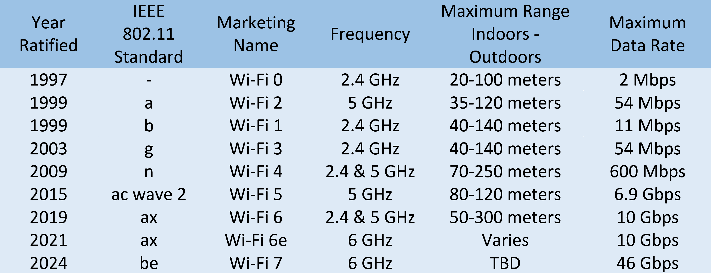

- [The Bits and Bytes of Computer Networking](#the-bits-and-bytes-of-computer-networking)
  - [Module 1: Introduction to Networking](#module-1-introduction-to-networking)
  - [Module 2: The Network Layer](#module-2-the-network-layer)
    - [The Network Layer](#the-network-layer)
    - [Subnetting](#subnetting)
    - [Routing](#routing)
      - [Basic Routing Table](#basic-routing-table)
      - [Interior Gateway Protocols](#interior-gateway-protocols)
      - [Exterior Gateway Protocols (EGP) and the IANA](#exterior-gateway-protocols-egp-and-the-iana)
      - [Non-Routable Address Space](#non-routable-address-space)
  - [Module 3: The Transport Layer](#module-3-the-transport-layer)
    - [The Transport Layer](#the-transport-layer)
      - [Dissection of a TCP Segment](#dissection-of-a-tcp-segment)
      - [TCP Control Flags and the Three-way Handshake](#tcp-control-flags-and-the-three-way-handshake)
      - [TCP Socket States](#tcp-socket-states)
      - [Connection-oriented and Connectionless Protocols](#connection-oriented-and-connectionless-protocols)
      - [Firewalls](#firewalls)
    - [The Application Layer](#the-application-layer)
      - [The Application Layer- Introduction](#the-application-layer--introduction)
      - [The Application Layer and the OSI Model](#the-application-layer-and-the-osi-model)
  - [Module 3: Network Services](#module-3-network-services)
    - [Name Resolution](#name-resolution)
      - [Why do we need DNS?](#why-do-we-need-dns)
      - [The Many Steps of Name Resolution](#the-many-steps-of-name-resolution)
      - [DNS and UDP](#dns-and-udp)
    - [Name Resolution In Practice](#name-resolution-in-practice)
      - [Resource Record Types](#resource-record-types)
      - [Anatomy of a Domain Name](#anatomy-of-a-domain-name)
      - [DNS Zones](#dns-zones)
    - [Dynamic Host Configuration Protocol (DHCP)](#dynamic-host-configuration-protocol-dhcp)
      - [Introduction to DHCP](#introduction-to-dhcp)
      - [DHCP in Action](#dhcp-in-action)
    - [Basics of NAT](#basics-of-nat)
      - [Introduction to NAT](#introduction-to-nat)
      - [NAT and the Transport Layer](#nat-and-the-transport-layer)
    - [Virtual Private Networks](#virtual-private-networks)
      - [Introduction to VPNs](#introduction-to-vpns)
      - [Proxy Services](#proxy-services)
  - [Modul 5: Introduction to Connecting to the Internet](#modul-5-introduction-to-connecting-to-the-internet)
    - [POSTS and Dial-Up](#posts-and-dial-up)
      - [Dial-up and Modems](#dial-up-and-modems)
    - [Brodband Connections](#brodband-connections)
      - [What is Broadband?](#what-is-broadband)
      - [T-Carrier Technologies](#t-carrier-technologies)
      - [Digital Subscriber Lines (DSL)](#digital-subscriber-lines-dsl)
      - [Cable Broadband](#cable-broadband)
      - [Fiber Optic Broadband](#fiber-optic-broadband)
    - [WANs](#wans)
      - [Wide Area Networks Technologies](#wide-area-networks-technologies)
      - [Supplemental Reading for WAN Protocols](#supplemental-reading-for-wan-protocols)
      - [Point-to-Point VPNs](#point-to-point-vpns)
    - [Wireless Networking](#wireless-networking)
      - [Introduction to Wireless Networking Technologies](#introduction-to-wireless-networking-technologies)
      - [Wi-Fi 6](#wi-fi-6)
      - [Supplemental Reading for Alphabet Soup](#supplemental-reading-for-alphabet-soup)
      - [Supplemental Reading for IoT Data Transfer Protocols](#supplemental-reading-for-iot-data-transfer-protocols)
      - [Wireless Network Configurations](#wireless-network-configurations)
      - [Wireless Channels](#wireless-channels)
      - [Wireless Security](#wireless-security)
      - [Protocols \& Encryption](#protocols--encryption)
      - [Cellular Networking](#cellular-networking)
      - [Other Resources](#other-resources)
  - [Modul 6: Troubleshooting and the Future of Networking](#modul-6-troubleshooting-and-the-future-of-networking)
    - [Verifying Network](#verifying-network)
      - [Ping: Internet Control Message Protocol (ICMP)](#ping-internet-control-message-protocol-icmp)
      - [Traceroute: Tracing the Path](#traceroute-tracing-the-path)
      - [Testing Port Connectivity](#testing-port-connectivity)
    - [Digging into DNS](#digging-into-dns)
      - [Name Resolution Tools](#name-resolution-tools)
      - [Public DNS Servers](#public-dns-servers)
      - [DNS Registration and Expiration](#dns-registration-and-expiration)
      - [Hosts Files](#hosts-files)
    - [The Cloud](#the-cloud)
      - [What is The Cloud?](#what-is-the-cloud)
      - [Everything as a Service](#everything-as-a-service)
      - [Cloud Storage](#cloud-storage)
      - [Quiz The Cloud](#quiz-the-cloud)
    - [IPv6](#ipv6)
      - [IPv6 Addressing and Subnetting](#ipv6-addressing-and-subnetting)
      - [IPv6 Headers](#ipv6-headers)
      - [IPv6 and IPv4 Harmony](#ipv6-and-ipv4-harmony)
      - [IPv6 and IPv4 harmony](#ipv6-and-ipv4-harmony-1)
      - [Quiz IPv6](#quiz-ipv6)
    - [Graded Assessment](#graded-assessment)
      - [Quiz IPv6 Compression](#quiz-ipv6-compression)
      - [Troubleshooting and the Future of Networking](#troubleshooting-and-the-future-of-networking)
  - [Glossary](#glossary)

# The Bits and Bytes of Computer Networking

## Module 1: Introduction to Networking

## Module 2: The Network Layer

### The Network Layer

### Subnetting

### Routing

#### Basic Routing Table

- Routing is the process of forwarding data packets across networks.
- A router is a network device that forwards traffic based on the destination address of the packet.
- Basic routing involves receiving a packet, examining the destination IP, looking up the destination network in the routing table, and forwarding the packet to the interface closest to the remote network.
- Routing tables contain information about networks and the interfaces to reach them.

#### Interior Gateway Protocols

- IGPs are utilized within a single autonomous system (AS), such as large corporations or national-scale ISPs.
- IGPs are further classified into link state routing protocols and distance vector protocols.
- Link state protocols ensure that each router possesses comprehensive knowledge of the entire network topology.
- Interior Gateway Protocols share information within a single autonomous system. Exterior Gateway Protocols are used for the exchange of information between independent autonomous systems.

#### Exterior Gateway Protocols (EGP) and the IANA

- Exterior gateway protocols facilitate communication between routers at the edges of different autonomous systems.
- Interior gateway protocols are used within the same organization, while exterior gateway protocols are used to share information across different organizations.
- The IANA (Internet Assigned Numbers Authority) helps manage IP address allocation and Autonomous System Number (ASN) allocation.

#### Non-Routable Address Space

- RFC 1918 defined three ranges of non-routable address space: 10.0.0.0/8, 172.16.0.0/12, and 192.168.0.0/16.
- Interior gateway protocols will route these address spaces within an autonomous system, but exterior gateway protocols will not.

## Module 3: The Transport Layer

### The Transport Layer

- The transport layer is responsible for multiplexing and demultiplexing traffic, establishing connections, ensuring data integrity, and keeping the network safe.
- Multiplexing and demultiplexing are done through ports, which are 16-bit numbers used to direct traffic to specific services running on a networked computer.

#### Dissection of a TCP Segment

- An Ethernet frame encapsulates an IP datagram, and an IP datagram encapsulates a TCP segment.
- A TCP segment consists of a TCP header and a data section.
- The TCP header contains various fields with important information
  - Source port and destination port fields
  - Sequence number: A 32-bit number used to keep track
  - Acknowledgment number: The number of the next expected segment
  - Data offset: A four-bit number that communicates the length of the TCP header.
  - TCP control flags: Six bits reserved for various control flags.
  - TCP window: A 16-bit number used for flow control.
  - Checksum: A 16-bit number used to ensure data integrity.
  - Urgent pointer: Used to point out segments that might be more important than others
  - Options field: used for more complicated flow control protocols.
  - Padding: A sequence of zeros to ensure the data payload section.

#### TCP Control Flags and the Three-way Handshake

- Three-Way Handshake : SYN, SYN/ACK, ACK.
- The six TCP control flags are URG (urgent), ACK (acknowledged), PSH (push), RST (reset), SYN (synchronize), and FIN (finish).
- The three-way handshake is used to establish a TCP connection.
- Once the three-way handshake is complete, the TCP connection is established and data can be sent in both directions.
- When one of the devices is ready to close the connection, a four-way handshake occurs, involving the exchange of FIN and ACK flags.

#### TCP Socket States

- Common TCP socket states include LISTEN, SYN_SENT, SYN_RECEIVED, ESTABLISHED, FIN_WAIT, CLOSE_WAIT, and CLOSED.

#### Connection-oriented and Connectionless Protocols

- Connection-oriented protocols establish a connection and use acknowledgments to ensure data transmission.
- Connectionless protocols do not rely on connections and do not support acknowledgments.
- TCP is useful when you need to ensure data reaches its destination, but it has more overhead.
- UDP is useful for less important messages, like streaming video, as it has less overhead.

#### Firewalls

- Firewalls are network devices that block traffic based on certain criteria.
- Firewalls can operate at different layers of the network, but they are most commonly used at the transport layer.
- Firewalls at the transport layer can block traffic to certain ports while allowing traffic to others.
- Firewalls can be independent network devices or run as programs on individual hosts.

- Aplication Layer: Firewalls can perform inspection of application layer traffic, allowing or blocking specific applications or protocols.
- Transport Layer: Firewalls commonly operate at the transport layer. They can block traffic to certain ports while allowing traffic to other ports.
- Network Layer: Some firewalls primarily deal with blocking ranges of IP addresses, operating at the network layer.
- Data Link Layer: Firewalls can also operate at the data link layer, inspecting and filtering traffic based on MAC addresses.

### The Application Layer

#### The Application Layer- Introduction

- The application layer is the layer in the networking model that deals with how applications send and receive data.
- The payload section of TCP segments contains the actual data that applications want to send to each other.
- There are many protocols used at the application layer, such as HTTP for web traffic and FTP for file transfers.

#### The Application Layer and the OSI Model

- The OSI (Open Systems Interconnection) model is another widely used model with seven layers.
- The fifth layer in the OSI model is the session layer, which facilitates communication between applications and the transport layer.
- The presentation layer in the OSI model ensures that application layer data can be understood by the application.
- While the OSI model is important to understand, our five-layer model is more practical for day-to-day networking.
- It's important to have a basic understanding of the OSI model in networking education.

## Module 3: Network Services

### Name Resolution

#### Why do we need DNS?

- Computers communicate with each other using numbers, specifically binary numbers (ones and zeros).
- Binary numbers can be difficult for humans to read and remember, so different forms of representation are used, especially in networking.
- **DNS (Domain Name System)** is a global and distributed network service that translates domain names (e.g., <www.weather.com>) into IP addresses (e.g., 184.29.131.121) that computers can understand.
- **DNS makes it easier for humans to remember** and access websites by using domain names instead of IP addresses.
- **DNS allows organizations to change the IP address** associated with a domain name without affecting end users.
- **DNS** is crucial for the functioning of the Internet and allows websites to be served from different locations around the world, improving performance for users in different regions.

#### The Many Steps of Name Resolution

- **DNS** using UDP (User Datagram Protocol) as generally used for name resolution. TCP (Transmission Control Protocol) is used when the response is too large for a single UDP datagram.
- **DNS (Domain Name System)** is a system that converts domain names into IP addresses.
- **DNS servers** need to be specifically configured at a node on a network.
- There are five primary types of **DNS** servers: **caching name servers**, **recursive name servers**, **root name servers**, **TLD name servers**, and **authoritative name servers**.
- **Caching** and **recursive** name servers store domain name lookups for a certain amount of time to prevent repeated lookups.
- The TTL (time to live) is a value that determines how long a name server can cache an entry before performing a full resolution again.
- TLD name servers point to authoritative name servers, which provide the actual IP address of the server in question.
- Local name servers cache DNS lookups to avoid performing a full lookup path for every TCP connection.

#### DNS and UDP

- UDP is connectionless, meaning there is no set up or tear down of a connection, resulting in less overall traffic.
- DNS requests and responses can usually fit inside a single **UDP** datagram, making it suitable for a connectionless protocol.
- DNS can generate a lot of traffic, especially when the full resolution needs to be processed.
- TCP requires a three-way handshake, multiple requests and responses, and a four-way handshake, resulting in a minimum of 44 packets.
- **UDP** requires fewer packets, with a total of eight packets for a full DNS lookup.
- **DNS** over TCP exists for cases where the response is too large for a single **UDP** datagram.

### Name Resolution In Practice

#### Resource Record Types

- **DNS** operates with a set of defined resource record types.
- The most common resource record is the **A record**, which points a domain name to an **IPv4 IP** address.
- A single domain name can have multiple A records, allowing for DNS round robin to balance traffic across multiple IPs.
- The **AAAA** record is similar to an A record but returns an IPv6 address instead.
- The **CNAME** record is used to redirect traffic from one domain to another.
- The MX record is used to deliver email to the correct server.
- The **SRV** record is used to define the location of various specific services.
- The **TXT** record was originally for descriptive text but is now used to convey additional data.
- There are other resource record types like **NS** and **SOA** used for authoritative information about **DNS** zones.

#### Anatomy of a Domain Name

- A domain name consists of three parts: the subdomain (e.g., www), the domain (e.g., google), and the top-level domain (e.g., com).
- The top-level domain (TLD) is the last part of a domain name and is defined by a limited number of options, such as .com, .net, .edu, and country-specific TLDs like .de for Germany or .cn for China.
- ICANN (Internet Corporation for Assigned Names and Numbers) is a non-profit organization responsible for administering and defining TLDs.
- When all the parts of a domain name are combined, it forms a fully qualified domain name (FQDN).
- A registrar is a company that has an agreement with ICANN to sell unregistered domain names.
- DNS (Domain Name System) can support up to 127 levels of domain in a single FQDN, but it is rare to see fully qualified domain names with that many levels.
- There are some restrictions on the length of each section of a domain name, with each section limited to 63 characters and a total limit of 255 characters for a complete FQDN.

#### DNS Zones

- Authoritative name servers are responsible for responding to name resolution requests for specific domains.
- An authoritative name server is responsible for a specific DNS zone.
- DNS zones are hierarchical and allow for easier control over multiple levels of a domain.
- Zones are configured through zone files, which declare all resource records for a particular zone.
- Zone files contain an SOA (Start of Authority) record that declares the zone and the name server authoritative for it.
- NS (Name Server) records indicate other name servers that might also be responsible for the zone.
- Zones can be configured to have subdomains, and reverse lookup zone files can be used to resolve an IP to a name.

### Dynamic Host Configuration Protocol (DHCP)

#### Introduction to DHCP

- DHCP (Dynamic Host Configuration Protocol) **automates** the configuration process of hosts on a network.
- DHCP can operate in different ways: **dynamic allocation**, **automatic allocation**, and **fixed allocation**.

#### DHCP in Action

- DHCP (Dynamic Host Configuration Protocol) is an **application layer** protocol used to configure network settings.
- DHCP relies on the **transport**, **network**, **data link**, and **physical layers** to operate.
- The DHCP discovery process has four steps: **server discovery**, **offer**, **request**, and **acknowledgement**.
- During server discovery, the **DHCP client** sends a **broadcast** message to find a **DHCP server**.
- The **DHCP server** examines its configuration and offers an **IP** address to the **client**.
- The **client** processes the offer and sends a request message to accept the offered **IP** address.
- The **DHCP server** acknowledges the request and sends a **DHCPACK** message to the client.

### Basics of NAT

#### Introduction to NAT

- NAT is a technique used to **translate** one IP address into another.
- NAT can provide additional **security** measures to a network.
- It allows a **gateway**, like a **router** or **firewall**, to **rewrite** the source IP of an outgoing IP datagram while retaining the original IP.
- **NAT** can **hide** the IP address of a computer from other devices on the network, providing a level of security known as IP masquerading.
- **One-to-many** NAT is a common use of **NAT**, where multiple computers on a network have their IPs translated by the router to its own IP, making the entire address space protected and invisible.

#### NAT and the Transport Layer

- **NAT (Network Address Translation)** at the network layer is relatively straightforward, where one IP address is translated to another by a router.
- However, **at the transport layer**, things become more complex, and additional techniques are used to ensure proper functioning.
- **Port preservation** is a technique where the source port chosen by a client is the same port used by the router, making it easier to direct traffic back to the correct computer.
- **Port forwarding** is a technique that allows specific destination ports to be configured to always be delivered to specific nodes, enabling IP masquerading and simplifying external access to services.
- **Masquerading** hides the source IP of an originating device,

### Virtual Private Networks

#### Introduction to VPNs

- A VPN uses tunneling protocols to encrypt data at the sending end and decrypts it at the receiving end.
- VPNs (Virtual Private Networks) are a **technology** that allows for the extension of a **private** or local network to a host that might not be on the same local network.
- Most VPNs use encryption to carry an **encrypted** payload in the **transport layer**, which contains a second set of packets for the network, transport, and application layers.

#### Proxy Services

- A proxy service is a server that acts on behalf of a client to access another service.
- Proxies exist at almost **every** layer of the networking model.
- **Web proxies** are specifically built for web traffic and can be used for increased performance or to restrict access to certain websites.
- **Reverse proxies** act as a **single front** end for multiple servers, distributing **incoming** requests and handling encryption and decryption work.

## Modul 5: Introduction to Connecting to the Internet

### POSTS and Dial-Up

#### Dial-up and Modems

- Dial-up connections used the **Public Switched Telephone Network (PSTN)** or Plain Old Telephone Service (POTS) to transfer data.
- Modems were used to convert computer data into audible wavelengths that could be transmitted over the phone lines.
- Early modems had low baud rates, but over time, the speed of dial-up connections increased to 14.4 kilobits per second.
- Dial-up Internet connectivity is now rare, but it was the main way computers communicated over long distances for several decades.
- Modems were used to convert computer data into audible wavelengths that could be transmitted over the phone lines.
- Early modems had low baud rates, but over time, the speed of dial-up connections increased to 14.4 kilobits per second.

### Brodband Connections

#### What is Broadband?

- Broadband internet refers to any connectivity technology that is not dial-up internet.
- Broadband connections are always on, providing faster and more reliable connections compared to dial-up.
- T-carrier technologies were commonly used by businesses in the mid-1990s to handle increasing bandwidth demands.
- T-carrier technologies were originally invented by AT&T to transmit multiple phone calls over a single link.
- Broadband technology unlocked the true potential of the internet for business and home users.
- T-carrier technologies require dedicated lines and are more commonly used by businesses due to their cost.

#### T-Carrier Technologies

- The first **T-carrier** specification, T1, allowed for up to **24** simultaneous phone calls on a single twisted pair copper wire.
- T1 lines can transmit data at a speed of 1.544 megabits per second.
- Multiple T1 lines can be combined to act as a single link, such as an AT3 line with 28 T1s achieving a speed of 44.736 **megabits** per second.
- T-carrier technologies are still in **use** today but have been largely replaced by other broadband technologies like **cable** or **fiber** connections.

#### Digital Subscriber Lines (DSL)

- The public telephone network was used to connect people to the Internet through dial-up connections.
- Digital Subscriber Line (DSL) technology was developed to transmit more data over telephone lines without interfering with voice calls.
- ADSL offers faster download speeds and slower upload speeds, while SDSL has equal upload and download speeds.
- **SDSL** (**Symmetric Digital Subscriber Line**) was initially used by businesses but is now common for both businesses and home users.
- There are other variations of DSL technology with different bandwidth options and operating distances.

#### Cable Broadband

- The Cable Communications Policy Act in 1984 deregulated the cable television business, leading to a boom in growth and adoption.
- Cable providers realized that coaxial cables used for TV delivery could also transmit high-speed internet data.
- Cable internet access is a shared bandwidth technology, where multiple users share the same connection until it reaches the ISP's core network.
- Cable internet connections are usually managed by a cable modem, which connects to the cable modem termination system (CMTS).

#### Fiber Optic Broadband

- Fiber connections are used in the core of the Internet because they offer higher speeds and can transmit data over longer distances without signal degradation.
- FTTX (fiber to the x) is a term used to describe different implementations of fiber connections.
- FTTN (fiber to the neighborhood) uses fiber to deliver data to a physical cabinet that serves a certain population, with copper or coax used for the last distance.
- FTTB (fiber to the building) delivers data to an individual building, with copper used for internal connections.
- FTTH (fiber to the home) involves running fiber to each individual residence in a neighborhood or apartment building.
- FTTH and FTTB may also be referred to as FTTP (fiber to the premises).
- Fiber connections use an **optical network terminator** (ONT) instead of a modem to convert data between fiber and traditional copper networks.

### WANs

#### Wide Area Networks Technologies

- WAN technologies require contracting a link with an ISP to send data between sites.
- WANs use **different** protocols at the **data link** layer to transport data.

#### Supplemental Reading for WAN Protocols

- WANs can be **connected** through the Internet with connections provided by Internet Service Providers (ISPs) in each locale.
- **Security** for WANs across the public Internet can be configured through Virtual Private Networks (VPNs).
- Software-Defined WAN (SD-WAN) is software developed to address the **unique** needs of cloud-based WAN environments.
- WAN optimization techniques include **compression**, **deduplication**, **protocol optimization**, l**ocal caching**, and **traffic shaping**.
- WAN protocols such as packet **switching**, **frame** **relay**, **ATM**, **HLDC**, **SONET/SDH**, and **MPLS** are used in conjunction with **WAN** routers to distinguish between private LANs and the related public **WAN**.

#### Point-to-Point VPNs

- WAN technologies are great for transporting large amounts of data across multiple sites, but they can be **expensive**.
- Cloud solutions have reduced the need for high-speed connections between sites.
- Point-to-point VPNs, also known as site-to-site VPNs, establish a secure tunnel between two sites.
- Point-to-point VPNs are similar to traditional VPN setups, but the tunneling logic is handled by **network devices**.

### Wireless Networking

#### Introduction to Wireless Networking Technologies

- Wireless networking allows devices to connect to computer networks without **physical cables**.
- Wireless communication works through **radio waves**.
- The most common specifications for wireless networking are defined by the IEEE 802.11 standards, also known as Wi-Fi.
- Wi-Fi networks operate on different frequency bands, such as **2.4 GHz** and **5 GHz**.
- 802.11 protocols define how wireless networks operate at the **physical** and **data link** layers.

#### Wi-Fi 6

- Wi-Fi 6, also known as **802.11ax**, is a significant advancement in Wi-Fi technology.
- It offers several benefits, including higher data rates, increased band capacity, better performance, and improved power efficiency.
- Wi-Fi 6 improves functionality and connectivity through features like channel sharing, **Target Wake Time** (TWT), **Multi-user MIMO**, **channel utilization**, **amplitude modulation**, **OFDMA**, and **transmit beamforming**.
- **160 MHz** channel utilization gives more space for transmitting data and increases bandwidth capability.
- **1024 Quadrature** amplitude modulation combines two signals into a single channel, so more data is encoded.
- Wi-Fi 6E is an additional certification for Wi-Fi 6 that adds a third 6 GHz band, providing even faster speeds and stronger performance.

#### Supplemental Reading for Alphabet Soup

- The reading discusses the 802.11 Wireless-Fidelity (Wi-Fi) standards and the different updates, such as a, b, g, n, ac, ad, af, ah, ax, ay, and az.
- The 2.4 GHz frequency has a longer signal range 150 feet (45 meters) indoors, can pass through walls, but can experience congestion and interference.
- The 5 GHz frequency has more channels, less interference, but a shorter range.
- The wireless range is limited to 50 feet (12 meters) indoors and 100 feet (30 meters) outdoors.
- Does not penetrate walls and other solid objects as well as 2.4 GHz.

#### Supplemental Reading for IoT Data Transfer Protocols

- IoT devices use data transfer protocols to send and receive data across networks.
- There are two common data protocol models for IoT devices: Request/Response model and Publish/Subscribe model.
- Examples of data protocols used in IoT include HTTP, CoAP, MQTT, AMQP, XMPP, and DDS.
- HTTP/HTTPS is widely used for information transfer on the World Wide Web and uses a request/response model.
- MQTT is an IoT data-centric interaction protocol that uses a publish/subscribe model and supports QoS.
- CoAP is a web transfer protocol for IoT constrained nodes and networks.
- AMQP is an open standard for messaging among applications in different organizations and platforms.
- XMPP is a decentralized, open standard for chat, messaging, and collaboration tools.
- DDS is an API standard and middleware protocol that helps devices in an IoT ecosystem share data efficiently.

#### Wireless Network Configurations

- There are three main types of wireless network configurations: ad-hoc networks, wireless LANs (WLANs), and mesh networks.
- Ad-hoc networks are the simplest type, where devices communicate **directly** with each other without any supporting network **infrastructure**. They are commonly used for smartphone-to-smartphone communication, industrial settings, and disaster relief efforts.
- **WLANs** consist of one or more access points that act as **bridges** between the wireless and wired networks. Wireless devices communicate with the access points to access resources outside of the WLAN.
- Mesh networks are similar to ad-hoc networks, but they typically consist of wireless access points connected to a wired network. This setup allows for increased performance and range by deploying more access points without the need for individual cables.

#### Wireless Channels

- Channels are individual sections of the frequency band used by a wireless network.
- They help address the issue of collision domains, where overlapping communications can cause interruptions.
- In wired networks, switches prevent collisions by sending traffic only to the intended recipient.
- Wireless networks don't have physical interfaces, so channels are used to reduce collisions.
- In the 2.4 GHz band, channels 1, 6, and 11 do not overlap for 802.11 B networks.
- Most wireless networking equipment can auto-sense congested channels and dynamically change them if needed.

#### Wireless Security

- Wired communication has inherent privacy because only the two nodes on either end of the **link** can read the data.
- **Wireless networking** is less secure because radio transmissions can be intercepted by anyone within range.
- **WEP (Wired Equivalent Privacy)** was developed to provide encryption for wireless networks, but it is a weak encryption algorithm.
- **WEP** uses a **40-bit** encryption key, which can be easily cracked in a few minutes.
- **WPA** (Wifi Protected Access) replaced **WEP** and uses a **128-bit** key, making it more difficult to crack.
- **MAC** filtering is another way to secure wireless networks by only allowing connections from trusted devices.
- **WPA2** is the most commonly used encryption algorithm for wireless networks and uses a **256-bit** key, making it even harder to crack.
- **MAC** filtering is another way to secure wireless networks by only allowing connections from trusted devices.

#### Protocols & Encryption

- **WPA3** is the third iteration of the Wi-Fi Protected Access (WPA) protocol and is intended to replace **WPA2**.
- **WPA3-Personal** is for individual users and home Wi-Fi networks, while WPA3-Enterprise is for business networks with multiple users.
- **WPA3-Personal** includes features like natural password selection, increased ease of use, forward secrecy, and Simultaneous Authentication of Equals (SAE).
- **WPA3-Enterprise** includes features like Galois/Counter Mode Protocol (GCMP-256), Opportunistic Wireless Encryption (OWE), Wi-Fi Device Provisioning Protocol (DPP), 384-bit Hashed Message Authentication Mode (HMAC) with Secure Hash Algorithm (SHA), and Elliptic Curve Diffie-Hellman Exchange (ECDHE) and Elliptic Curve Digital Signature Algorithm (ECDSA).
- These new features in WPA3 improve Wi-Fi security, authentication, encryption, and protection against cyberattacks.

#### Cellular Networking

- Cellular networking, also known as mobile networking, is a popular form of wireless networking.
- Cellular networks operate over radio waves and have specific frequency bands reserved for cellular transmissions.
- These frequencies can travel over longer distances, usually spanning many **kilometers** or **miles**.
- Cellular networks are built around the concept of cells, with each cell assigned a specific frequency band.

#### Other Resources

- Some of the common network protocols for IoT devices include Wi-Fi, IEEE 802.15.4, ZigBee, Thread, Z-Wave, Bluetooth, Near-Field Communication (NFC), and Long Range Wide Area Network (LoRaWan).
- **IEEE 802.15.4** is a low-power wireless access technology used for IoT devices that operate on battery power.
- **ZigBee** is an LR-WPAN protocol used for smart home and commercial IoT products.
- **Thread** is a low-latency wireless mesh networking protocol compatible with a broad spectrum of IoT ecosystems.
- **Z-Wave** is an interoperable, wireless mesh protocol used for controlling and monitoring IoT smart devices.
- **Bluetooth** is a widely used wireless network for short-distance connections among computing and IoT devices.
- **NFC** is a short-range, low data wireless communication protocol used for secure transactions and pairing processes.
- **LoRaWan** is an open-source networking protocol designed for connecting battery-powered, wireless IoT devices to the internet in widely dispersed networks.

## Modul 6: Troubleshooting and the Future of Networking

### Verifying Network

#### Ping: Internet Control Message Protocol (ICMP)

- ICMP (Internet Control Message Protocol) is an error-reporting protocol that network devices such as routers use to generate error messages to the source IP address when network problems prevent delivery of IP packets.
- An **ICMP** packet consists of a header with fields like type and code, a checksum, and a data payload.
- The ping tool allows you to send ICMP echo requests to check if a destination is reachable.
- The output of the ping command includes the address sending the reply, round-trip time, TTL, and packet size.

#### Traceroute: Tracing the Path

- Traceroute is a utility that helps determine the path between two nodes and provides information about each hop along the way.
- It works by manipulating the TTL (Time to Live) field at the IP level, decrementing it for each hop.
- Traceroute sends multiple packets, with the TTL field set to different values, to ensure that each hop discards the packet and sends an ICMP time-exceeded message back.
- The output of a Traceroute command includes the hop number, round trip time, IP address, and hostname (if available) for each hop.
- Traceroute has more options than can be specified using command line flags.

#### Testing Port Connectivity

- Netcat can be run through the command "nc" and requires a host and port as arguments. It can establish a connection and allow you to send application layer data to the listening service.
- The "-z" flag in Netcat can be used to check the status of a port, and the "-v" flag provides more detailed output.

### Digging into DNS

#### Name Resolution Tools

- The most common command line tool for name resolution is nslookup, available on Linux, Mac, and Windows.

#### Public DNS Servers

- ISPs (Internet Service Providers) usually **provide** a **recursive** name server, which is all you need for your computer to communicate with other devices on the Internet.
- Another option is to use a DNS as a service **provider**.
- Level 3 and Google are examples of organizations that provide public DNS servers.

#### DNS Registration and Expiration

- DNS (Domain Name System) is a global system managed in a tiered hierarchy with ICANN at the top level.
- Registering a domain name involves creating an account with a registrar, searching for an available domain name, and agreeing upon a price and registration length.
- Domain names can be transferred from one party to another or from one registrar to another.
- Domain name registrations have a fixed duration, and it's important to keep track of expiration dates to prevent others from registering them.

#### Hosts Files

- Hosts files were used to correlate numbered network addresses with words.
- Hosts files were used to correlate numbered network addresses with words.
- A host file is a flat file that contains network addresses followed by the corresponding host names.
- Hosts files are evaluated by the networking stack of the operating system and can be used to refer to network addresses anywhere.
- Modern operating systems still have hosts files, including those on phones and tablets.

### The Cloud

#### What is The Cloud?

- The Cloud is a concept in computing where computing resources are provisioned in a sharable way.
- Cloud computing relies on hardware virtualization, which allows multiple virtual instances to run on a single physical machine.
- The Cloud allows for sharing resources among multiple instances, reducing the need for purchasing and maintaining physical servers.
- **Hybrid Clouds** combine private and public Clouds, with sensitive technologies hosted on the private Cloud and less sensitive servers on the public Cloud.

#### Everything as a Service

- X as a service (XaaS) is a term used in cloud computing.
- **Infrastructure as a Service** (IaaS) provides virtualized computing resources over the internet. you pay someone else to provide network and server infrastructure.
- **Platform as a service (PaaS)** provides a platform for customers to run their services without needing an entire server.
- **Software as a service (SaaS)** is a way of licensing software to others while keeping it hosted and managed.
- **SaaS** has become popular for things like email and web-based applications.

#### Cloud Storage

- Cloud storage is a popular way to store data **securely** and **access** it easily.
- Cloud storage **eliminates** the need for managing a storage array and monitoring hardware components.
- Cloud storage solutions grow with your needs, and you only pay for the storage you use.
- Cloud storage is not only useful for replacing large-scale local storage arrays but also for backing up smaller bits of data, like photos on a smartphone.

#### Quiz The Cloud

1. A piece of software that runs and manages virtual machines is known as a **Hypervisor**
2. What is Office 365 Outlook an example of? **SaaS**
3. A hybrid cloud is ? **a combination of a public cloud and a private cloud**
4. Which of the following are  cloud services? Select all that apply.
   - **IaaS**
   - **PaaS**
   - **SaaS**
5. Which cloud service provides access to things like virtual machines, containers, networks, and storage? **IaaS**

### IPv6

#### IPv6 Addressing and Subnetting

- IPv4 addresses are 32 bits, allowing for around 4.2 billion individual addresses.
- IPv6 addresses are **128 bits**, allowing for a much larger number of addresses.
- IPv6 addresses are written in groups of **16 bits**, with each group made up of four hexadecimal numbers.
- Leading zeros in a group can be removed, and consecutive groups of zeros can be replaced with two colons.
- The IPv6 address space has **reserved** ranges for documentation, multicast, and link-local unicast.
- IPv6 subnetting uses cider notation to define a subnet mask against the network ID portion of an IPv6 address.

#### IPv6 Headers

- The IPv6 header includes fields such as **version**, traffic **class**, **flow label**, **payload length**, **next header**, **hop limit**, and **source/destination** address.
- The **version** field indicates the IP version in use.
- The **traffic class** field defines the type of **traffic** and allows for **different** priorities.
- The **flow label field** is used by routers to determine the **quality** of service for a specific **datagram**.
- The **payload length** field specifies the length of the data payload section.
- The **next header** field identifies the type of header immediately following the current one.
- The **hop limi**t field is similar to the TTL field in IPv4 and limits the number of hops a packet can take.
- The **source** and **destination** address fields are each 128 bits long.
- **Optional headers** can be included after the main IPv6 header, forming a chain of headers if needed.

#### IPv6 and IPv4 Harmony

- IPv6 adoption is not possible for the entire Internet and all connected networks to switch to IPv6 all at once.
- IPv6 and IPv4 traffic need to **co-exist** to allow individual organizations to transition to IPv6.
- **IPv4-mapped** address space allows IPv4 traffic to travel over an IPv6 network.
- **IPv6 traffic** needs a way to travel over IPv4 networks, which is achieved through IPv6 tunnels.
- **IPv6 tunnel** brokers provide IPv6 tunneling endpoints without additional equipment.
- There are competing protocols for IPv6 tunnels, but the future is the adoption of IPv6 as the main protocol at the network layer.

#### IPv6 and IPv4 harmony

- IPv4 and IPv6 have different structures for their datagrams, so they speak different languages.
- IPv6 tunneling protocols are used to allow IPv6 traffic to travel over the remaining IPv4 network.
- There are three commonly used tunnel protocols: 6in4/manual protocol, Tunnel Setup Protocol (TSP), and Anything in Anything (AYIYA) protocol.

#### Quiz IPv6

1. An IPv6 address is how many bits long? **128**
2. What is the very first field in an IPv6 header? **Version**
3. Which IPv6 header field indicates how many routers can forward a packet before it's discarded? **Hop Limit**
4. The IPv4 mapped address space within IPv6 always starts with _______ zeroes. **80**
5. For IPv6 traffic to travel on an IPv4 network, which two technologies are used? Select all that apply. **IPv6 tunnels, Datagrams**

### Graded Assessment

#### Quiz IPv6 Compression

| No | Original                                | Comppress                               |
|----|-----------------------------------------|-----------------------------------------|
| 1  | ad93:a0e4:a9ce:32fc:cba8:15fe:ed90:d768 | ad93:a0e4:a9ce:32fc:cba8:15fe:ed90:d768 |
| 2  | 9930:cafa:0000:0052:04cc:7b7a:0037:27e6 | 9930:cafa:0:52:4cc:7b7a:37:27e6         |
| 3  | 5d66:5ec9:0046:0000:2576:004f:7159:0639 | 5d66:5ec9:46:0:2576:4f:7159:639         |
| 4  | 8bfa:99f0:d4c5:0b8c:0f6f:04df:2804:283d | 8bfa:99f0:d4c5:b8c:f6f:4df:2804:283d    |
| 5  | 00eb:0000:0000:0000:d8c1:0946:0272:0879 | eb::d8c1:946:272:879                    |
| 6  | 0e56:11c2:0e75:8d23:3528:7e0d:419b:bdce | e56:11c2:e75:8d23:3528:7e0d:419b:bdce   |
| 7  | 00c8:b434:06ee:ec2f:03c9:01ce:765d:a66b | c8:b434:6ee:ec2f:3c9:1ce:765d:a66b      |
| 8  | 558c:0000:0000:d367:7c8e:1216:0000:66be | 558c::d367:7c8e:1216:0:66be             |
| 9  | 7d2b:00a9:a0c4:0000:a772:00fd:a523:0358 | 7d2b:a9:a0c4:0:a772:fd:a523:358         |
| 10 | 2b06:0000:0000:1f2b:d77f:0000:0000:89ce | 2b06::1f2b:d77f:0:0:89ce                |

#### Troubleshooting and the Future of Networking

1. The ability for a protocol or program to determine that something went wrong is known as ? **Error detection**
2. The first field of an Internet Control Message Protocol (ICMP) packet specifies the message type. Which choices represent message type examples? Select all that apply. **Echo request, Destination unreachable, Time exceeded**
3. Which two tools function similar to traceroute? (Choose all that apply) **tracert, mtr, pathping**
4. You run the Test-NetConnection command on a Windows PC while only providing a host name. As a result, what default action does the command use? **IMCP eEcho request**
5. What is one of the most commonly used name resolution tools? **nslookup**
6. When troubleshooting Domain Name System (DNS) problems, which helpful feature do public servers usually support? **ICMP echo requests**
7. With virtualization, a single physical machine, called a host, can run many individual virtual instances, called ______.   **Guests**
8. What is The IPv6 loopback address? **::1**
9. When shortening an Internet Protocol (IP) v6 address, which two rules are used? Select two that apply. **Removing all leading ones, Replace groups of ones with semicolons.**
10. Which Internet Protocol (IP) v6 field is identical in purpose to the TTL field in an IPv4 header? **Hop limit**

## Glossary

- [Glossary](./assets/glossary.docx)